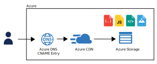

# Azure Storage Static Website



This Terraform module provides the required infrastructure to host a static website on Azure Storage.

[](https://github.com/messeb/terraform-az-static-website)
[](https://github.com/messeb/terraform-az-static-website)
[](https://github.com/messeb/terraform-az-static-website)
[](https://github.com/messeb/terraform-az-static-website)
[](https://github.com/messeb/terraform-az-static-website)

## Details

* Uploads the files in the specified local directory to the `$web` container in the specified storage account.
* Creates a CDN endpoint for the storage account.
* Adds a custom domain, via DNS CNAME record, to the CDN endpoint.
* Adds a CDN managed certificate to the custom domain.

## Usage

```hcl
module "static_website" {
  source = "github.com/messeb/terraform-az-static-website"

  resource_group_name           = "az-static-website"
  resources_base_name           = "az-static-website"
  location                      = "westeurope"
  referer_check_file_extensions = ["css", "jpeg", "jpg", "gif", "js", "png", "svg", "webp", "zip"]
  index_file                    = "index.html"
  error_file                    = "404.html"
  web_folder                    = "public"

  sub_domain_dns = {
    resource_group_name = "example-dns-rg"
    zone_name           = "example.com"
    root_domain         = "example.com"
    sub_domain_name     = "az-static-website"
  }
}
```

## Example

* URL: [https://az-static-website.messeb.net](https://az-static-website.messeb.net)
* README: [example/README.md](example/README.md)

## Resources

| Name | Type |
|------|------|
| [random_string.rnd](https://registry.terraform.io/providers/hashicorp/random/latest/docs/resources/string) | resource |
| [azurerm_resource_group.rg](https://registry.terraform.io/providers/hashicorp/azurerm/latest/docs/resources/resource_group) | resource |
| [azurerm_storage_account.sa](https://registry.terraform.io/providers/hashicorp/azurerm/latest/docs/resources/storage_account) | resource |
| [azurerm_storage_blob.static-web-demo-storage-blob](https://registry.terraform.io/providers/hashicorp/azurerm/latest/docs/resources/storage_blob) | resource |
| [azurerm_cdn_profile.website-cdnprofile](https://registry.terraform.io/providers/hashicorp/azurerm/latest/docs/resources/cdn_profile) | resource |
| [azurerm_cdn_endpoint.website-endpoint](https://registry.terraform.io/providers/hashicorp/azurerm/latest/docs/resources/cdn_endpoint) | resource |
| [azurerm_dns_cname_record.cname_record](https://registry.terraform.io/providers/hashicorp/azurerm/latest/docs/resources/dns_cname_record) | resource |
| [azurerm_cdn_endpoint_custom_domain.cdn_custom_domain](https://registry.terraform.io/providers/hashicorp/azurerm/latest/docs/resources/cdn_endpoint_custom_domain) | resource |
| [null_resource.destroy_cname_record](https://registry.terraform.io/providers/hashicorp/null/latest/docs/resources/resource) | resource |

## Inputs

| Name | Description | Type | Default | Required |
|------|-------------|------|---------|:--------:|
| resource_group_name | Resource group in which the resources will be created. | `string` | n/a | yes |
| resources_base_name | Basename for all of the resources. | `string` | n/a | yes |
| location | Azure cloud region | `string` | n/a | yes |
| referer_check_file_extensions | List of file extension for which a "referer" header is checked | `list(string)` | `[]` | no |
| index_file | Index page of the website | `string` | `"index.html"` | no |
| error_file | 404 error page of the website | `string` | `"404.html"` | no |
| sub_domain_dns.resource_group_name | Resource group of the DNS zone of the root domain | `string` | n/a | yes |
| zone_name | Zone name of the root domain | `string` | n/a | yes |
| root_domain | Root domain of the website | `string` | n/a | yes |
| sub_domain_name | Sub-domain of the website | `string` | n/a | yes |

## Outputs

| Name | Description |
|------|-------------|
| website_url | The HTTPS-URL of the statice website. |
